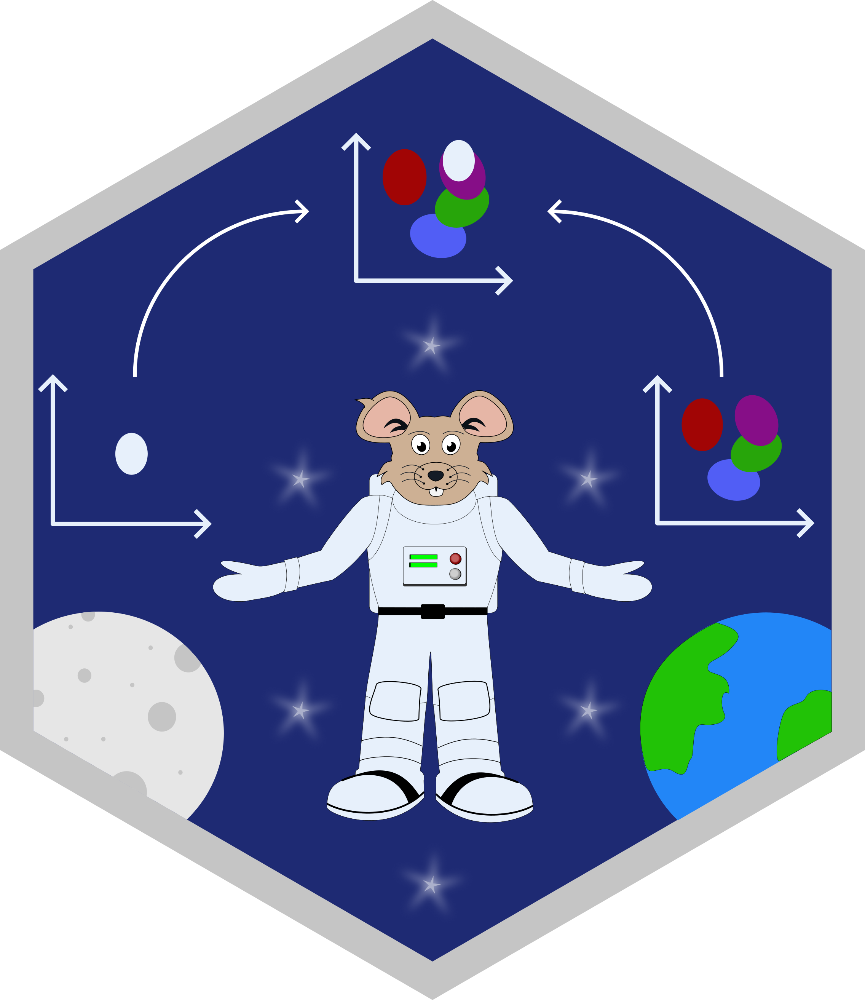

<!-- README.md is generated from README.Rmd. Please edit that file -->

```{r, include = FALSE}
knitr::opts_chunk$set(
    collapse = TRUE,
    comment = "#>",
    fig.path = "man/figures/README-",
    out.width = "100%"
)
```
# spaceRAT 

<!-- badges: start -->
[](https://www.tidyverse.org/lifecycle/#experimental)
<!-- badges: end -->

## Installation

*Dependencies*

```{r dependencies, eval = FALSE}
# Install Bioconductor dependencies
if (!require("BiocManager", quietly = TRUE))
    install.packages("BiocManager")

BiocManager::install(c("SummarizedExperiment", "S4Vectors"))

# Install spaceRATScaffolds from github
remotes::install_github("shdam/spaceRATScaffolds", build_vignettes = TRUE)
```


*Install from GitHub*
``` {r install, eval = FALSE}
remotes::install_github("shdam/spaceRAT", build_vignettes = TRUE)
```

## View vignettes

``` {r vignettes, eval = FALSE}
browseVignettes(package = "spaceRAT")
```

## Usage

It takes two steps to perform ranked analysis of transcriptome:

1. build a scaffold space
2. project your new samples onto the scaffold. 

Example code will be provided here to illustrate each.
Additional information can be found in the vignettes.

### Build a scaffold space

There are two ways to get a scaffold space.
You can either obtain the prebuilt DMAP, or build a
scaffold space of your own, by passing as arguments a count matrix,
a phenotype table, an a column name of the phenotype table
to function `buildScaffold()`.  
  
Build a scaffold with example data:
```{r build} 
library(spaceRAT)
data("DMAP_exprs", "DMAP_pData", package = "spaceRATScaffolds")
scaffold <- buildScaffold(
    DMAP_exprs, pheno = DMAP_pData,
    colname = "cell_types", data = "exprs")
plotScaffold(
    scaffold, title = "Scaffold Plot",
    dimred = "PCA", dims = c(1,2), plot_mode = "dot")
```


### Project new samples

Get a list of available prebuilt scaffolds with:

```{r list_scaffolds} 
library("spaceRATScaffolds")
listScaffolds()
```

Project a sample of interest into a custom built or prebuilt scaffold:

```{r project}
# Load count data
data("ilaria_counts", package="spaceRATScaffolds")

# Load custom or prebuilt scaffold
scaffold <- buildScaffold("DMAP_scaffold")

# Project sample
projectSample(
    sample = ilaria_counts,
    scaffold = scaffold, 
    plot_mode = "dot",
    dims = c(1,2),
    dimred = "PCA",
    title = "Samples projected into DMAP scaffold in PCA space")

```

