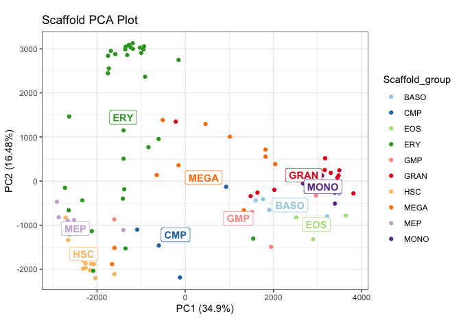
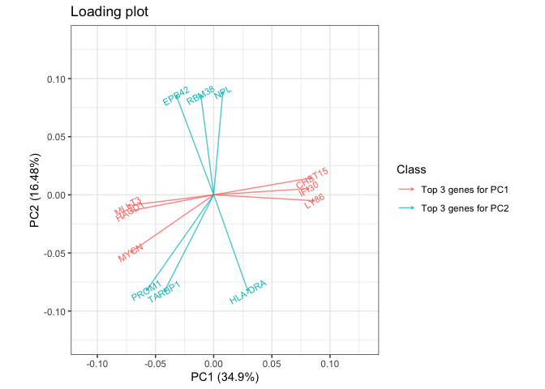
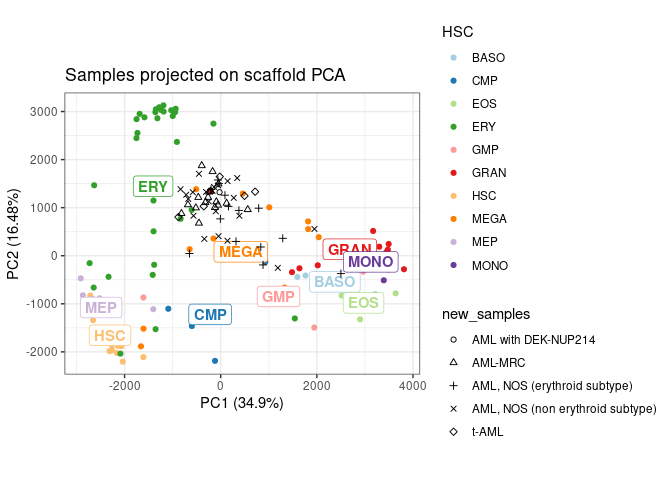
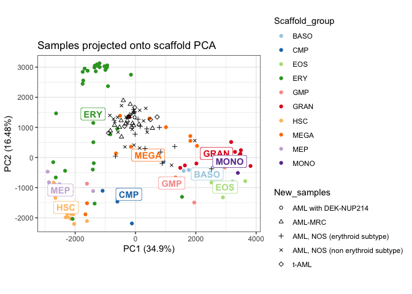

<!-- README.md is generated from README.Rmd. Please edit that file -->

# spaceRAT

<!-- badges: start -->

[](https://www.tidyverse.org/lifecycle/#experimental)
<!-- badges: end -->

# spaceRAT 

## Install from GitHub

``` r
# Install using devtools
# install.packages("devtools")
devtools::install_github("XueningHe/spaceRAT")
```

## Usage

It takes two steps to perform ranked analysis of transcriptome:

1.  build a scaffold space
2.  project your new samples onto the scaffold.

**Build a scaffold space**

There are two ways to get a scaffold space. You can either obtain the
prebuilt DMAP or GTEX space, or build a scaffold space of your own, by
passing as arguments a count matrix, a phenotype table, an a column name
of the phenotype table to function `buildScaffold()`.

To get the prebuilt DMAP space:

``` r
library(spaceRAT)
utils::data("exprs_dmap", "pData_dmap", "exprs_ilaria", "pData_ilaria",
            package = "spaceRAT")
g <- buildScaffold("prebuilt_DMAP")
plotScaffold(g, "Scaffold Plot")
```


You can also turn on the “tiny_label” mode by specifying `plot_mode`.
You can also visualize other principle components by specifying `dims`.

``` r
g <- buildScaffold("prebuilt_DMAP",plot_mode = "tiny_label",dims=c(3,4))
plotScaffold(g, "Scaffold Plot")
#> plot_mode='tiny_label', shorter names for cell types in
#>                 phenotype table yields better visualization.
```


Notice, please assign the returned value of `buildScaffold()` to a named
variable, which will be used later.

To build your own space, first prepare count matrix and phenotype table.
Count matrix should have class `matrix`, or a data frame that can be
converted to `matrix`. Column names are sample names. Row names are gene
names, which can be Ensembl Gene ID, HGNC Symbol, Entrez Gene ID
Ensembl, Transcript ID or Refseq mRNA. All gene ID will be automatically
converted to Ensembl Gene ID. Counts of several transcript ID
corresponding to same gene will be added and recorded as the counts of
the gene. Below is a valid (logged) count matrix:

``` r
exprs_dmap[1:5,1:5]
#>                     HSC1_1    HSC1_13     HSC1_14     HSC1_2     HSC1_3
#> ENSG00000100296 -0.2305090 -0.2332090  0.09349099 -0.3661090 -0.3439090
#> ENSG00000122707  0.7680782  0.1729782  0.33177820  0.6280782  0.7424782
#> ENSG00000149308  0.1828161 -0.3864839 -0.02568389 -0.2718839  0.3774161
#> ENSG00000133026  2.2084867  1.4643867  1.72818673  1.4515867  1.8478867
#> ENSG00000005339  0.2062100 -0.2908900 -0.14789005 -0.2360900 -0.1336900
```

Phenotype table should have row names as sample names identical to count
matrix, as well as at least one column for cell types, or any sample
feature suitable for grouping cells and perform differential expression
analysis. For example:

``` r
pData_dmap[1:5,,drop=FALSE]
#>         cell_types
#> HSC1_1         HSC
#> HSC1_13        HSC
#> HSC1_14        HSC
#> HSC1_2         HSC
#> HSC1_3         HSC
```

Then call:

``` r
g <- buildScaffold(exprs_dmap,pData_dmap,"cell_types")
#> Warning in all(as.character(seq_len(6) %in% rownames(pheno)[seq_len(6)])):
#> coercing argument of type 'character' to logical
#> Preprocessing complete.
#> Finding differentially expressed genes
#> Reducing dimensions.
#> Done.
plotScaffold(g, "Scaffold Plot")
```



Here `"cell_types"` is the name of a column of `pData_dmap`, according
to which cells are grouped and labeled. Differential expression analysis
will also be performed using this column of phenotype as independent
variables.

When building a user-defined scaffold space, `buildScaffold()` first
preprocesses count matrix. It removes genes with total counts less than
10 and replaces `NA` by 0. Then it performs differential expression
analysis to select differentially expressed genes (DE genes), subsets
the scaffold dataset to contain only the DE genes, ranks the genes
within each sample, finally performs principle component analysis (PCA)
using ranks.

By default `buildScaffold()` takes in logged count matrix. It can also
handle raw count data if `data="raw"` is specified.

**Make sense of scaffold space** Function `loadingPlot()` visualizes the
genes that contribute most to the selected principle components, thus
facilitating the understanding of scaffold space. It returns a data
frame containing the loading scores as well.

``` r
loadingPlot(g)
#> Convert gene indentifiers of count matrix from ensembl_gene to hgnc_symbol.
```



**Project new samples** To project new samples onto the scaffold PCA
plot, first prepare the count matrix of new samples. For example:

``` r
exprs_ilaria[1:5,1:5]
#>                 SJAEL011865 SJAEL011868 SJAEL011872 SJAEL011873 SJAEL011874
#> ENSG00000000003       96.00        62.0       11.00       84.00      146.00
#> ENSG00000000005        3.00         0.0        0.00        2.00        3.00
#> ENSG00000000419     1344.00      2566.0      644.00     1007.00     1866.00
#> ENSG00000000457      349.54       536.2      143.83      229.16      194.75
#> ENSG00000000460      810.46      1405.8      162.17      749.84      239.25
```

Then run:

``` r
projectSample(g, exprs_ilaria)
#> Preprocessing complete.
#> 6 genes are added to count matrix
#>         with imputed expression level 0.
#> Scale for colour is already present.
#> Adding another scale for colour, which will replace the existing scale.
#> Coordinate system already present. Adding new coordinate system, which will
#> replace the existing one.
```



By passing corresponding phenotype table and column name to
`projectSample()`, the plot can show more information about new samples:

``` r
pData_ilaria[1:5,,drop = FALSE]
#>                                  cancer_type
#> SJAEL011865                          AML-MRC
#> SJAEL011868                          AML-MRC
#> SJAEL011872 AML, NOS (non erythroid subtype)
#> SJAEL011873 AML, NOS (non erythroid subtype)
#> SJAEL011874                            t-AML
projectSample(g, exprs_ilaria,pData_ilaria,"cancer_type")
#> Warning in all(as.character(seq_len(6) %in% rownames(pheno)[seq_len(6)])):
#> coercing argument of type 'character' to logical
#> Preprocessing complete.
#> 6 genes are added to count matrix
#>         with imputed expression level 0.
#> Coordinate system already present. Adding new coordinate system, which will
#> replace the existing one.
```


