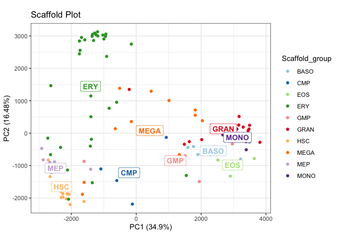
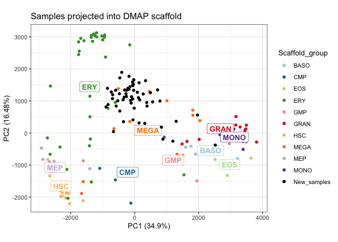

<!-- README.md is generated from README.Rmd. Please edit that file -->

# spaceRAT 

<!-- badges: start -->

[](https://www.tidyverse.org/lifecycle/#experimental)
<!-- badges: end -->

## Install from GitHub

``` r
# Install using devtools
# install.packages("devtools")
devtools::install_github("XueningHe/spaceRAT", build_vignettes = TRUE)
```

## View vignettes

``` r
browseVignettes(package = "spaceRAT")
```

## Usage

It takes two steps to perform ranked analysis of transcriptome:

1.  build a scaffold space
2.  project your new samples onto the scaffold.

Example code will be provided here to illustrate each. Additional
information can be found in the vignettes.

### Build a scaffold space

There are two ways to get a scaffold space. You can either obtain the
prebuilt DMAP or GTEX space, or build a scaffold space of your own, by
passing as arguments a count matrix, a phenotype table, an a column name
of the phenotype table to function `buildScaffold()`.

Build as space with example data:

``` r
library(spaceRAT)
data("exprs_dmap", "pData_dmap", package="spaceRATScaffolds")
scaffold <- buildScaffold(exprs_dmap, pheno_scaffold = pData_dmap, colname = "cell_types")
#> Preprocessing complete.
#> Finding differentially expressed genes
#> Reducing dimensions.
#> Done.
plotScaffold(scaffold, "Scaffold Plot")
```



### Project new samples

Get a list of available prebuilt scaffolds with:

``` r
library(spaceRATScaffolds)
listScaffolds()
#> [1] "DMAP_scaffold"
```

Project a sample of interest into a custom built or prebuilt scaffold:

``` r
# Load count data
data("exprs_ilaria", package="spaceRATScaffolds")

# Load custom or prebuilt scaffold
scaffold <- buildScaffold("DMAP_scaffold")

# Project sample
projectSample(
    space = scaffold,
    sample = exprs_ilaria,
    title = "Samples projected into DMAP scaffold")
#> Preprocessing complete.
#> 6 genes are added to count matrix
#>         with imputed expression level 0.
#> Scale for colour is already present.
#> Adding another scale for colour, which will replace the existing scale.
#> Coordinate system already present. Adding new coordinate system, which will
#> replace the existing one.
```


