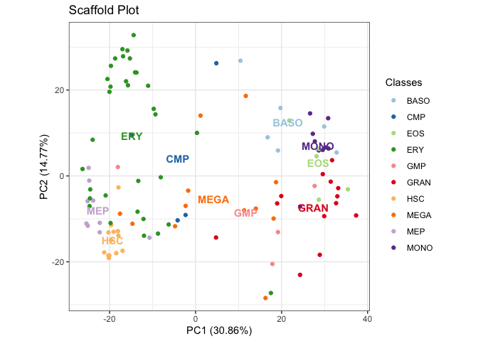

<!-- README.md is generated from README.Rmd. Please edit that file -->

# spaceRAT 

<!-- badges: start -->

[](https://www.tidyverse.org/lifecycle/#experimental)
<!-- badges: end -->

## Installation

*Dependencies*

``` r
# Install Bioconductor dependencies
if (!require("BiocManager", quietly = TRUE))
    install.packages("BiocManager")

BiocManager::install(c("SummarizedExperiment", "S4Vectors", "BiocStyle"))

# If you run into Matrix/irlba issues, 
# try reinstalling both from source and restart your R session:
install.packages("Matrix", type = "source")
install.packages("irlba", type = "source")

# Install spaceRATScaffolds from github
remotes::install_github("shdam/spaceRATScaffolds", build_vignettes = TRUE)
```

*Install from GitHub*

``` r
remotes::install_github("shdam/spaceRAT", build_vignettes = TRUE)
```

## View vignettes

``` r
browseVignettes(package = "spaceRAT")
```

## Usage

It takes two steps to perform ranked analysis of transcriptome:

1.  build a scaffold space
2.  project your new samples onto the scaffold.

Example code will be provided here to illustrate each. Additional
information can be found in the vignettes.

### Build a scaffold space

There are two ways to get a scaffold space. You can either obtain the
prebuilt scaffolds, or build a scaffold space of your own, by providing
a count matrix, a phenotype table, and a column name of the phenotype
table to `buildScaffold()`.

Build a scaffold with example data:

``` r
library(spaceRAT)
#> Loading required package: spaceRATScaffolds
data("DMAP_exprs", "DMAP_pData", package = "spaceRATScaffolds")
scaffold <- buildScaffold(
    DMAP_exprs, pheno = DMAP_pData,
    colname = "cell_types", data = "exprs", pca_scale = TRUE)
#> Preprocessing complete.
#> Finding differentially expressed genes
#> Reducing dimensions.
#> Scaffold is built.
plotScaffold(
    scaffold, title = "Scaffold Plot",
    dimred = "PCA", dims = c(1,2), plot_mode = "dot")
```



### Project new samples

Get a list of available prebuilt scaffolds with:

``` r
library("spaceRATScaffolds")
listScaffolds()
#> ℹ Successfully fetched list of published records - page 1
#> ✔ Successfully fetched list of published records!
#> ✔ Successfully fetched record for DOI '10.5281/zenodo.10842509'!
#> [1] "TCGA.v2" "DMAP.v1" "GTEx.v1" "TCGA.v1"
```

Project a sample of interest into a custom built or prebuilt scaffold:

``` r
# Load count data
data("ilaria_counts", package="spaceRATScaffolds")

# Load custom or prebuilt scaffold
scaffold <- buildScaffold("DMAP") # omitting '.vX' gets the latest version
#> ℹ Successfully fetched list of published records - page 1
#> ✔ Successfully fetched list of published records!
#> ✔ Successfully fetched record for DOI '10.5281/zenodo.10842509'!

# Project sample
projectSample(
    sample = ilaria_counts,
    scaffold = scaffold, 
    plot_mode = "dot",
    dims = c(1,2),
    dimred = "PCA",
    sample_name = "New Samples",
    title = "Samples projected into DMAP scaffold in PCA space")
#> Preprocessing complete.
#> 6 genes are added to count matrix with imputed expression level 0.
```


