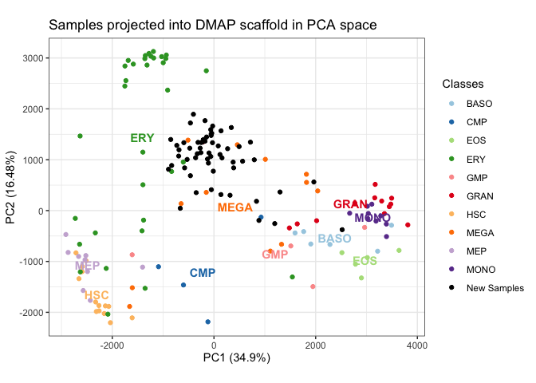

<!-- README.md is generated from README.Rmd. Please edit that file -->

# spaceRAT 

<!-- badges: start -->

[](https://www.tidyverse.org/lifecycle/#experimental)
<!-- badges: end -->

## Installation

*Dependencies*

``` r
# Install Bioconductor dependencies
if (!require("BiocManager", quietly = TRUE))
    install.packages("BiocManager")

BiocManager::install(c("SummarizedExperiment", "S4Vectors"))

# Install spaceRATScaffolds from github
remotes::install_github("shdam/spaceRATScaffolds", build_vignettes = TRUE)
```

*Install from GitHub*

``` r
remotes::install_github("XueningHe/spaceRAT", build_vignettes = TRUE)
```

## View vignettes

``` r
browseVignettes(package = "spaceRAT")
```

## Usage

It takes two steps to perform ranked analysis of transcriptome:

1.  build a scaffold space
2.  project your new samples onto the scaffold.

Example code will be provided here to illustrate each. Additional
information can be found in the vignettes.

### Build a scaffold space

There are two ways to get a scaffold space. You can either obtain the
prebuilt DMAP, or build a scaffold space of your own, by passing as
arguments a count matrix, a phenotype table, an a column name of the
phenotype table to function `buildScaffold()`.

Build a space with example data:

``` r
library(spaceRAT)
data("DMAP_exprs", "DMAP_pData", package="spaceRATScaffolds")
scaffold <- buildScaffold(
    DMAP_exprs, pheno = DMAP_pData,
    colname = "cell_types", data = "exprs")
#> Preprocessing complete.
#> Finding differentially expressed genes
#> Reducing dimensions.
#> Scaffold is built.
plotScaffold(
    scaffold, title = "Scaffold Plot",
    dim_reduction = "PCA", dims = c(1,2), plot_mode = "dot")
```


### Project new samples

Get a list of available prebuilt scaffolds with:

``` r
library("spaceRATScaffolds")
listScaffolds()
#> [1] "DMAP_scaffold"
```

Project a sample of interest into a custom built or prebuilt scaffold:

``` r
# Load count data
data("ilaria_counts", package="spaceRATScaffolds")

# Load custom or prebuilt scaffold
scaffold <- buildScaffold("DMAP_scaffold")

# Project sample
projectSample(
    sample = ilaria_counts,
    space = scaffold,
    dims = c(1,2),
    title = "Samples projected into DMAP scaffold")
#> Preprocessing complete.
#> 6 genes are added to count matrix with imputed expression level 0.
```


